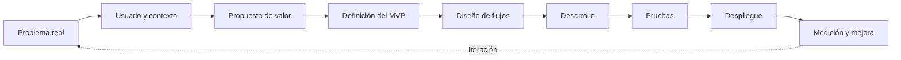
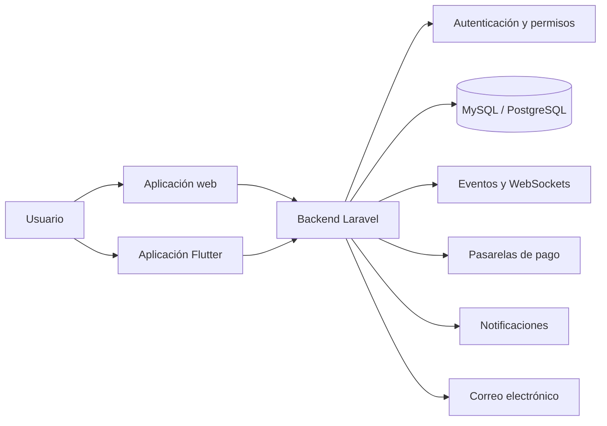

---

## Sobre mí

Soy Full Stack Developer Jr. con más de tres años de experiencia entre desarrollo profesional y proyectos propios. He trabajado principalmente con **Laravel, PHP, Livewire, MySQL y Flutter**, construyendo aplicaciones web, APIs, paneles administrativos y soluciones móviles.

Soy fundador y desarrollador de **WorldFit** y **Tastely**, dos productos SaaS que me han permitido participar en todo el ciclo de creación de software: análisis del problema, definición del producto, diseño de base de datos, desarrollo, integración de servicios, despliegue y mantenimiento.

También me interesa comprender la parte de negocio detrás de cada producto: propuesta de valor, procesos operativos, experiencia del usuario, monetización, automatización y mejora continua.

Actualmente busco dar el siguiente paso hacia un rol de Full Stack Developer de tiempo completo, donde pueda aportar la experiencia práctica adquirida en mis proyectos, aprender de otros desarrolladores y continuar fortaleciendo mis conocimientos técnicos y de producto.

<table>
<tr>
<td width="50%" valign="top">

### Lo que puedo aportar

- Experiencia construyendo productos reales.
- Desarrollo backend con Laravel y PHP.
- Diseño de bases de datos y APIs REST.
- Interfaces administrativas con Livewire.
- Desarrollo móvil con Flutter.
- Integraciones de pagos y servicios externos.
- Diagnóstico de incidencias en producción.
- Criterio funcional y orientación a producto.

</td>
<td width="50%" valign="top">

### Lo que estoy fortaleciendo

- Pruebas unitarias y de integración.
- Arquitectura limpia y patrones de diseño.
- CI/CD con GitHub Actions.
- Contenedores con Docker.
- Seguridad para aplicaciones SaaS.
- Monitoreo y observabilidad.
- Optimización de rendimiento.
- Trabajo colaborativo en equipos de desarrollo.

</td>
</tr>
</table>

---

## Stack tecnológico

---

## Proyectos destacados

### WorldFit — SaaS para la gestión de gimnasios

**Fundador y desarrollador Full Stack** · 2024 — Presente  
**Stack:** Laravel · Livewire · MySQL/PostgreSQL · Flutter · Firebase · REST APIs · Nginx/VPS

WorldFit es una plataforma orientada a digitalizar la operación de gimnasios mediante módulos administrativos, servicios para miembros y una aplicación móvil.

**Trabajo realizado:**

- Diseñé la estructura funcional del producto y sus principales módulos.
- Desarrollé la administración de membresías, clientes, sucursales, entrenadores, nutrición, rutinas, inventario y punto de venta.
- Implementé separación de información por negocio y sucursal.
- Construí APIs REST para la aplicación móvil.
- Trabajé en autenticación, roles, permisos, códigos QR y TOTP.
- Integré servicios de pago, correo y notificaciones.
- Desarrollé la aplicación móvil con Flutter.
- Configuré despliegues, variables de entorno, SSL, base de datos y servidor.

---

### Tastely — SaaS para la gestión de restaurantes

**Fundador y desarrollador Full Stack** · 2024 — Presente  
**Stack:** Laravel · Livewire · Laravel Reverb · MySQL · REST APIs · Nginx/VPS

Tastely es un producto enfocado en organizar procesos operativos de restaurantes y negocios gastronómicos.

**Trabajo realizado:**

- Diseñé módulos para menús, pedidos, mesas, cocina, inventario, clientes y punto de venta.
- Implementé actualizaciones en tiempo real mediante WebSockets.
- Trabajé en un Kitchen Display System para el seguimiento de comandas.
- Diseñé flujos para repartidores, pedidos y estados de entrega.
- Analicé integraciones con WhatsApp Business Cloud API.
- Preparé la estructura del producto para operar como servicio SaaS.
- Configuré el entorno de producción, SSL y respaldos.

---

### Restaurante Calle Sabor — Sitio y sistema administrativo

**Desarrollo y mantenimiento** · 2023  
**Stack:** Laravel · MySQL · JavaScript · Git · VPS

- Desarrollo de sitio institucional y panel administrativo.
- Mantenimiento de base de datos y migraciones.
- Configuración de repositorios GitHub y Bitbucket.
- Resolución de problemas de despliegue, permisos, SSH y enlaces simbólicos.
- Diagnóstico de incidencias reales en producción.

---

## Impacto y experiencia práctica

| Indicador | Resultado |
|---|---|
| Productos SaaS propios | 2 productos en desarrollo y operación |
| Sectores trabajados | Fitness, gimnasios, restaurantes y soporte técnico |
| Plataformas desarrolladas | Web administrativa, landing pages y aplicación móvil |
| Responsabilidades | Análisis, producto, backend, frontend, base de datos, despliegue y mantenimiento |
| Integraciones | Pagos, correo, notificaciones, QR, TOTP, APIs y WebSockets |
| Entornos | Desarrollo local, hosting compartido y VPS Linux |
| Enfoque | Resolver procesos reales y convertirlos en flujos digitales |

> Las cifras de usuarios, ventas o transacciones se agregarán cuando existan métricas públicas y verificables.

---

## Retos técnicos que he enfrentado

| Reto | Solución aplicada |
|---|---|
| Separar información entre negocios y sucursales | Modelado relacional, filtros por contexto y validaciones de acceso |
| Actualizar pedidos y comandas en tiempo real | Eventos de aplicación y comunicación mediante WebSockets |
| Procesar pagos y activaciones | Integración de webhooks y validación de estados |
| Mantener funcionalidad móvil con conexión limitada | Persistencia local y sincronización progresiva |
| Controlar accesos y funcionalidades | Roles, permisos, autenticación, QR y TOTP |
| Desplegar aplicaciones Laravel | Configuración de servidor, permisos, variables de entorno, SSL y base de datos |
| Resolver fallos en producción | Revisión de logs, consultas SQL, caché, migraciones y configuración |
| Organizar sistemas con muchos módulos | Separación por dominios, servicios, componentes y flujos funcionales |

---

## Experiencia profesional

### Analista de Mesa de Ayuda — Macropay

**Noviembre de 2023 — Presente**

- Gestión y seguimiento de tickets de soporte técnico.
- Diagnóstico de incidencias mediante consultas SQL.
- Validación de integraciones y endpoints con Postman.
- Administración del ciclo de accesos en sistemas internos.
- Comunicación con usuarios y seguimiento de problemas operativos.

**Tecnologías:** SQL · MySQL · Postman · REST APIs · Office 365

### Desarrollador Web Jr. — Digitrafico

**2023**

- Desarrollo de aplicaciones web con Laravel y PHP.
- Implementación de interfaces con JavaScript, jQuery y Bootstrap.
- Integración con APIs REST externas.
- Participación en requerimientos, desarrollo, pruebas y despliegue.
- Control de versiones con Git y GitHub.

**Stack:** Laravel · PHP · JavaScript · jQuery · HTML5 · CSS3 · Bootstrap · SQL · Git

---

## Competencias técnicas

| Área | Tecnologías y conocimientos |
|---|---|
| **Backend** | PHP, Laravel, Eloquent ORM, Livewire, Sanctum, migraciones, seeders, validaciones y colas |
| **Frontend** | HTML5, CSS3, JavaScript, Blade, Alpine.js, Bootstrap, Tailwind CSS y Vite |
| **Mobile** | Flutter, Dart, navegación, consumo de APIs, persistencia local, Firebase y notificaciones |
| **Bases de datos** | MySQL, PostgreSQL, modelado relacional, consultas SQL, índices, restricciones y respaldos |
| **Integraciones** | Stripe, Conekta, Mercado Pago, Resend, SMTP, Firebase Cloud Messaging, QR y TOTP |
| **Tiempo real** | Laravel Reverb, WebSockets, eventos para pedidos, cocina y seguimiento |
| **Control de versiones** | Git, GitHub, Bitbucket, ramas, commits, remotos, SSH y resolución de conflictos |
| **Infraestructura** | Linux, Ubuntu, Nginx, Apache, VPS, SSL/TLS, Hostinger y variables de entorno |
| **Producto y UX/UI** | Flujos de usuario, onboarding, paneles administrativos, diseño responsive y definición de MVP |
| **Metodologías** | MVC, trabajo por módulos, documentación técnica y fundamentos de metodologías ágiles |

---

## Conocimientos de producto y negocio

| Competencia | Aplicación práctica |
|---|---|
| **Modelos SaaS** | Planes, suscripciones, niveles de servicio y productos multiempresa |
| **Propuesta de valor** | Identificación del problema, usuario objetivo, beneficios y diferenciadores |
| **Monetización** | Pagos recurrentes, planes mensuales y anuales y servicios adicionales |
| **Validación de producto** | Priorización de módulos, MVP y retroalimentación de usuarios |
| **Experiencia del cliente** | Registro, onboarding, activación, soporte, retención y renovación |
| **Procesos empresariales** | Digitalización de ventas, inventario, accesos, membresías, pedidos y reportes |
| **Marketing de producto** | Landing pages, mensajes comerciales, llamados a la acción y presentación de beneficios |
| **Métricas** | Conversión, usuarios activos, ingresos recurrentes, retención y uso de funcionalidades |

---

## Prácticas de desarrollo

- Separación de responsabilidades mediante servicios y componentes.
- Uso de migraciones y seeders para reproducir estructuras de datos.
- Validación de información en frontend y backend.
- Aplicación de roles y permisos para restringir funcionalidades.
- Manejo de credenciales mediante variables de entorno.
- Control de versiones con ramas y commits descriptivos.
- Diagnóstico de errores mediante logs y consultas SQL.
- Documentación de instalaciones, comandos y despliegues.
- Optimización de consultas y revisión de índices.
- Diseño responsive orientado a diferentes dispositivos.

---

## Cómo abordo un proyecto

---

## Arquitectura general de mis proyectos

---

## Educación y formación

### Ingeniería en Sistemas Computacionales

**Instituto Tecnológico del Sur del Estado de Yucatán**  
2018 — 2023

### Cursos y certificaciones

- MySQL Server.
- CSS y JavaScript.
- Introducción a SQL.
- Introducción a Java.
- Java I.

---

## Información adicional

| Aspecto | Detalle |
|---|---|
| **Ubicación** | Ticul, Yucatán, México |
| **Disponibilidad** | Tiempo completo |
| **Modalidad** | Remoto, híbrido o presencial |
| **Idioma principal** | Español |
| **Inglés** | Lectura técnica y aprendizaje continuo |
| **Intereses** | SaaS, fitness, restaurantes, automatización, mobile y productos digitales |

---

## Estadísticas de GitHub

---

## Lo que busco

Estoy en una transición activa hacia un rol de Full Stack Developer de tiempo completo. He construido, lanzado y actualmente mantengo dos productos SaaS de forma independiente. Ahora busco integrarme a un equipo donde pueda aportar mi experiencia de principio a fin, colaborar con otros desarrolladores y seguir fortaleciendo mis habilidades técnicas y de producto.

---

## Contacto

**Desarrollo software mientras continúo aprendiendo a convertir ideas en productos útiles.**

Productos SaaS propios · Experiencia full stack · Disponible para tiempo completo

