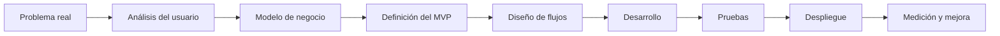
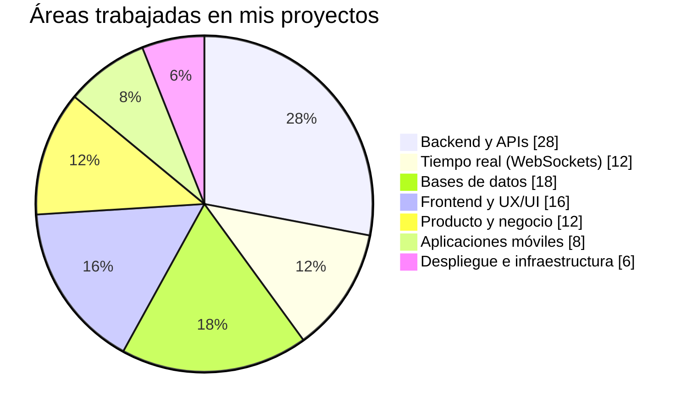

# Jesús Enrique Magaña

### Desarrollador Full Stack Jr. · Laravel · Livewire · Flutter · Arquitectura SaaS

Construyo productos SaaS reales de principio a fin: backend, base de datos, tiempo real, integraciones de pago/mensajería, apps móviles y despliegue en producción. Actualmente busco una oportunidad para seguir creciendo como desarrollador dentro de un equipo.

---

## 👋 Sobre mí

Soy desarrollador Full Stack Jr., pero con experiencia práctica construyendo y **manteniendo en producción** plataformas SaaS multi-tenant reales para negocios de fitness y restaurantes: **WorldFit** y **Tastely**.

No solo escribo código: participo en todo el ciclo de vida del producto — desde el modelo de negocio y la propuesta de valor, hasta el diseño de interfaz, el desarrollo, el despliegue y la resolución de problemas en servidores de producción. Esto significa que puedo integrarme rápido a un equipo y aportar valor más allá de una sola capa del stack.

**Lo que me diferencia como junior:**
- Ya he lanzado y opero productos SaaS reales con usuarios, no solo proyectos de práctica.
- Manejo el stack completo: backend, base de datos, tiempo real (WebSockets), frontend, mobile e infraestructura.
- Tengo criterio de producto: entiendo por qué se construye una función, no solo cómo.
- Buen ojo para UI/UX: interfaces cuidadas, con identidad visual y experiencia premium.

---

## 🚀 Proyectos destacados

### WorldFit — SaaS de gestión para gimnasios
Plataforma completa para administrar membresías, miembros, entrenadores, nutrición, rutinas, control de acceso, inventario y reportes.
- **Stack:** Laravel 11, Livewire 3, MySQL, arquitectura multi-tenant.
- Módulo administrativo completo, sistema de permisos, directorio SEO de gimnasios (`/gimnasios`) con datos estructurados Schema.org y páginas por ciudad.
- Diagnóstico y corrección de problemas de producción (caché agresiva de CDN, conflictos de despliegue).
- App móvil complementaria en **Flutter** (Riverpod, go_router) con onboarding y autenticación animados.
- 🔗 [worldfit.com.mx](https://worldfit.com.mx/)

### Tastely — SaaS multi-tenant para restaurantes
Solución para digitalizar la operación completa de un restaurante: pedidos, cocina, delivery y atención al cliente por WhatsApp.
- **Stack:** Laravel, Livewire, Laravel Reverb (WebSockets) para eventos en tiempo real.
- Integración con **WhatsApp Business Cloud API** (Meta), incluyendo flujo de Embedded Signup y evaluación de proveedores (Kapso Sandbox vs. Meta directo) con arquitectura abstraída para producción.
- **KDS** (Kitchen Display System) interactivo para cocina en tiempo real.
- Dashboard de repartidor con mapa, flujo de viaje completo, selección de pago y resumen de ganancias.
- Planeación de migración a VPS (Hetzner / Hostinger KVM con Ploi.io) para soportar WebSockets en producción.

### Calle Sabor — Sistema de operación para restaurante en producción
Aplicación Laravel usada activamente para administrar la operación de un restaurante real.
- Migraciones, base de datos, control de versiones y **despliegue en Hostinger**.
- Resolución de incidentes reales de producción: symlinks rotos, permisos SSH, conflictos de `git pull`.

### Kiosco de autoservicio — Prototipo de pedidos sin asistencia
Interfaz tipo cadena de comida rápida para pedidos en punto de venta.
- Flujo completo: catálogo, carrito, confirmación de pedido y seguimiento por QR.
- Entregable portable en un solo archivo HTML, con marca ficticia y 9 pantallas de flujo completo.

### La Terraza Gourmet — Menú digital y sistema operativo del restaurante
- Motor de temas, integración con WhatsApp Cloud API, seguimiento de pedidos en tiempo real con Reverb.
- Módulo de nómina con check-in y generación de recibos de pago en PDF.

### Cotizador freelance (softwarecorp)
- Asistente para generar cotizaciones de proyectos con PDFs de marca usando **jsPDF**.

---

## 🛠️ Competencias técnicas

| Área | Tecnologías |
|---|---|
| **Backend** | PHP, Laravel (9–11), Eloquent ORM, Livewire 3, Laravel Reverb (WebSockets), Sanctum, colas, migraciones |
| **Frontend** | HTML5, CSS3, JavaScript, Blade, Alpine.js, Bootstrap, Tailwind CSS, Vite |
| **Mobile** | Flutter, Dart, Riverpod, go_router, Lucide Icons, Firebase, consumo de APIs REST |
| **Bases de datos** | MySQL, modelado relacional, arquitecturas multi-tenant con base compartida, consultas SQL, respaldos |
| **Tiempo real** | Laravel Reverb, WebSockets, eventos en vivo (pedidos, cocina, tracking) |
| **Integraciones** | WhatsApp Business Cloud API (Meta), Kapso, Stripe, Resend/SMTP, Firebase Cloud Messaging, jsPDF, generación de QR, TOTP |
| **Control de versiones** | Git, GitHub, Bitbucket, ramas, resolución de conflictos, SSH |
| **Infraestructura / despliegue** | Linux, Apache/Nginx, Hostinger (shared hosting), migración a VPS (Hetzner, Ploi.io), variables de entorno |
| **Diseño de producto / UX-UI** | Flujos de usuario, onboarding, paneles administrativos, diseño responsive, estética premium/oscura |
| **IA aplicada** | Uso de asistentes de IA para arquitectura, depuración, documentación y prototipado rápido |

---

## 🧠 Cómo abordo un proyecto

---

## 📊 Experiencia por áreas

> Esta gráfica representa las áreas en las que he trabajado con mayor frecuencia; no es una medición oficial de nivel.

---

## 🎯 Lo que busco

Estoy buscando **incorporarme a un equipo de desarrollo** donde pueda seguir creciendo técnicamente, aportar lo que ya sé de Laravel/Livewire y producto, y aprender buenas prácticas de ingeniería (testing, CI/CD, arquitectura limpia) de la mano de desarrolladores con más experiencia.

Si tu equipo necesita a alguien que ya sabe llevar un producto de la idea al despliegue en producción — y que además cuida el diseño — hablemos.

---

## 📈 Estadísticas de GitHub

---

## 📬 Contacto

**¿Buscas a alguien que convierta ideas en productos funcionando? Hablemos.**

---

Perfil en crecimiento · Proyectos SaaS reales en producción · Disponible para nuevas oportunidades

