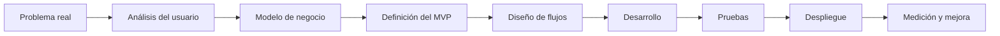
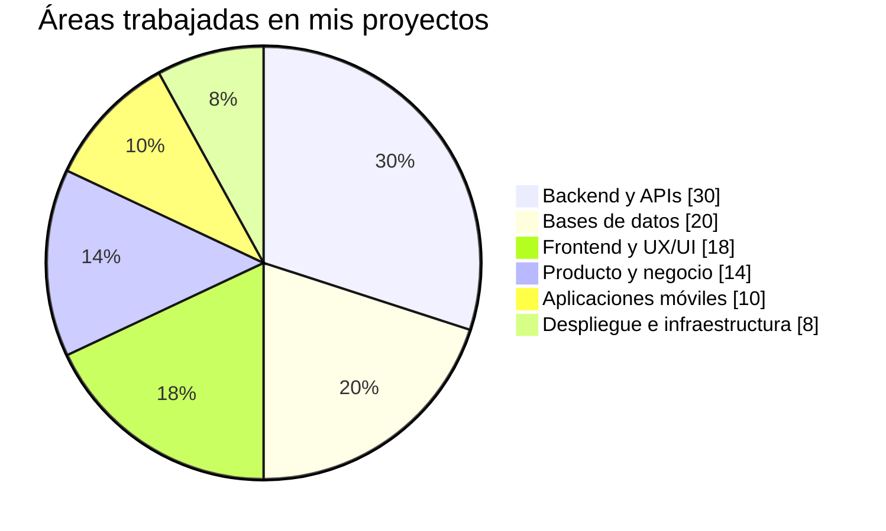

# Jesús Enrique Magaña

### Desarrollador Full Stack Jr. · Creador de productos digitales · Aprendiz de arquitectura SaaS

Construyo aplicaciones web y móviles mientras continúo fortaleciendo mis conocimientos en desarrollo de software, producto, automatización y modelos de negocio digitales.

---

## Sobre mí

Soy desarrollador Full Stack Jr. con interés en crear soluciones que conecten la tecnología con las necesidades reales de un negocio.

He participado en la construcción de plataformas SaaS, sistemas administrativos, puntos de venta, aplicaciones móviles y herramientas de automatización. Además del código, me interesa comprender cómo funciona un producto: a quién ayuda, qué problema resuelve, cómo puede generar ingresos y qué necesita para crecer.

Actualmente continúo aprendiendo sobre arquitectura de software, seguridad, experiencia de usuario, inteligencia artificial, despliegues y validación de modelos de negocio.

<table>
<tr>
<td width="50%" valign="top">

### Lo que hago

- Desarrollo aplicaciones con Laravel y PHP.
- Diseño bases de datos con MySQL.
- Creo interfaces web responsivas.
- Consumo y desarrollo APIs REST.
- Desarrollo aplicaciones móviles con Flutter.
- Integro pagos, correo y notificaciones.
- Trabajo con Git y repositorios remotos.
- Analizo flujos y procesos empresariales.

</td>
<td width="50%" valign="top">

### Lo que estoy aprendiendo

- Arquitectura limpia y modular.
- Pruebas automatizadas.
- Seguridad para aplicaciones SaaS.
- Optimización y escalabilidad.
- DevOps y despliegue continuo.
- Inteligencia artificial aplicada.
- Diseño y validación de productos.
- Métricas y crecimiento de negocios digitales.

</td>
</tr>
</table>

---

## Proyectos y productos

| Proyecto | Tipo | Descripción | Trabajo realizado |
|---|---|---|---|
| **WorldFit** | SaaS para gimnasios | Plataforma para administrar membresías, miembros, entrenadores, nutrición, rutinas, acceso, inventario, ventas y reportes. | Backend con Laravel, base de datos, permisos, APIs, landing, módulos administrativos, experiencia de usuario y aplicación móvil en Flutter. |
| **Tastely** | SaaS gastronómico | Solución para digitalizar operaciones de restaurantes y negocios de alimentos. | Concepto de producto, modelo funcional, punto de venta, pedidos, inventario, cocina, clientes, reportes y administración. |
| **Calle Sabor** | Sistema para restaurante | Aplicación Laravel utilizada para administrar la operación de un restaurante. | Migraciones, base de datos, despliegue, Git, repositorios, mantenimiento y resolución de problemas en producción. |
| **CubitTech** | Marca de desarrollo | Proyecto orientado a crear soluciones digitales para empresas. | Identidad de producto, propuesta comercial, desarrollo web, diseño de servicios y estrategia de soluciones SaaS. |
| **Aplicación WorldFit** | Aplicación móvil | App para que miembros de gimnasios consulten rutinas, progreso, nutrición, tienda, beneficios y acceso. | Maquetación en Flutter, navegación, onboarding, autenticación, consumo de API, assets, personajes y experiencia móvil. |
| **Kiosco de autoservicio** | Producto para restaurantes | Interfaz similar a los kioscos de cadenas de comida para realizar pedidos sin asistencia. | Flujo de compra, catálogo, carrito, confirmación, QR de seguimiento y propuesta visual SaaS. |
| **Monitor de tickets** | Extensión de navegador | Herramienta para actualizar un panel, detectar nuevos tickets y mostrar alertas. | JavaScript, manipulación del DOM, observadores, temporizadores, almacenamiento de configuración y notificaciones. |
| **Watch faces** | Diseño para smartwatch | Interfaces para relojes con estilos enfocados en programación y pantallas OLED. | Diseño visual, componentes, assets SVG/PNG y trabajo con Watch Face Studio. |

---

## Competencias técnicas

| Área | Conocimientos y herramientas |
|---|---|
| **Backend** | PHP, Laravel, Eloquent ORM, Livewire, Laravel Sanctum, validaciones, migraciones, seeders y colas |
| **Frontend** | HTML5, CSS3, JavaScript, Blade, Bootstrap, Tailwind CSS, Alpine.js y Vite |
| **Mobile** | Flutter, Dart, consumo de APIs, navegación, diseño responsivo, Firebase y notificaciones |
| **Bases de datos** | MySQL, modelado relacional, consultas SQL, índices, restricciones, migraciones y respaldos |
| **Integraciones** | Stripe, Resend, SMTP, Firebase Cloud Messaging, QR, TOTP, webhooks y APIs REST |
| **Control de versiones** | Git, GitHub, Bitbucket, ramas, commits, remotos, SSH y resolución de conflictos |
| **Infraestructura** | Linux, Apache, Nginx, Hostinger, VPS, variables de entorno y despliegues Laravel |
| **Diseño de producto** | UX/UI, flujos de usuario, onboarding, paneles administrativos y diseño responsive |
| **Herramientas visuales** | Rive, SVG, edición de assets, prototipado y diseño de interfaces |
| **Inteligencia artificial** | Uso de asistentes de IA para análisis, documentación, diseño, depuración y automatización |

---

## Tecnologías

 

---

## Conocimientos de producto y negocio

No solo me interesa desarrollar funcionalidades. También busco comprender por qué se construyen y cómo aportan valor.

| Competencia | Aplicación |
|---|---|
| **Modelos SaaS** | Planes mensuales y anuales, pruebas, niveles de servicio y productos multiempresa |
| **Propuesta de valor** | Identificación del problema, usuario objetivo, beneficios y diferenciadores |
| **Monetización** | Suscripciones, pagos recurrentes, comisiones y venta de servicios |
| **Validación de producto** | Priorización de módulos, producto mínimo viable y retroalimentación de usuarios |
| **Experiencia del cliente** | Registro, onboarding, activación, soporte, retención y renovación |
| **Procesos empresariales** | Digitalización de ventas, inventario, accesos, membresías, pedidos y reportes |
| **Marketing de producto** | Landing pages, mensajes comerciales, llamados a la acción y presentación de beneficios |
| **Métricas** | Conversión, usuarios activos, ingresos recurrentes, retención y uso de funcionalidades |

---

## Cómo abordo un proyecto

---

## Experiencia por áreas

> Esta gráfica representa las áreas en las que he trabajado con mayor frecuencia; no es una medición oficial de nivel.

---

## En qué estoy trabajando

- Mejorar la arquitectura y seguridad de **WorldFit**.
- Desarrollar la aplicación móvil de la plataforma con **Flutter**.
- Crear mejores flujos para rutinas, nutrición, membresías y acceso.
- Investigar catálogos y APIs de ejercicios.
- Diseñar productos digitales orientados a gimnasios y restaurantes.
- Fortalecer mis conocimientos en pruebas, CI/CD e infraestructura.
- Aprender a integrar inteligencia artificial de forma útil y responsable.

---

## Estadísticas de GitHub

---

## Objetivos profesionales

<table>
<tr>
<td width="33%" align="center">
<strong>Corto plazo</strong>  
Fortalecer mis bases técnicas y publicar proyectos mejor documentados.
</td>
<td width="33%" align="center">
<strong>Mediano plazo</strong>  
Participar en equipos donde pueda aprender, aportar y trabajar con buenas prácticas.
</td>
<td width="33%" align="center">
<strong>Largo plazo</strong>  
Crear productos tecnológicos sostenibles que resuelvan problemas reales.
</td>
</tr>
</table>

---

## Contacto

---

### Desarrollo software mientras aprendo a convertir ideas en productos.

Perfil en crecimiento · Aprendizaje continuo · Proyectos reales

