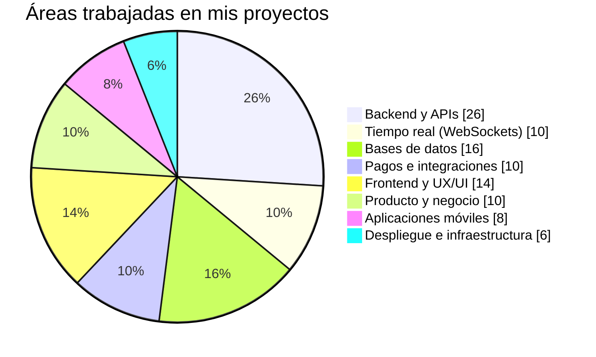

📍 Ticul, Yucatán, México

---

## 👋 Sobre mí

Full Stack Developer con **más de 3 años** de experiencia diseñando, desarrollando y desplegando plataformas SaaS multi-tenant en producción. Especializado en **Laravel, Livewire, PHP, PostgreSQL/MySQL y Flutter**, con dominio de arquitectura de APIs REST, integración de pasarelas de pago (Stripe, Conekta, Mercado Pago) vía webhooks, y administración de infraestructura Linux/VPS (Nginx, SSL).

Soy **fundador y desarrollador único de dos productos SaaS propios en producción** — WorldFit (gestión de gimnasios) y Tastely (gestión de restaurantes) — con responsabilidad de extremo a extremo: arquitectura, backend, frontend, app móvil, despliegue y mantenimiento.

Actualmente en **transición activa hacia un rol de Full Stack Developer de tiempo completo**: combino mi puesto en Macropay con el desarrollo diario de mis productos SaaS propios, y estoy listo para dedicar mi jornada completa a un equipo de desarrollo.

**Lo que aporto desde el día uno:**
- Ya he lanzado y opero productos SaaS reales con usuarios, no solo proyectos de práctica.
- Manejo el stack completo: backend, base de datos, tiempo real (WebSockets), frontend, mobile e infraestructura.
- Experiencia real integrando pagos, autenticación OAuth, arquitectura offline-first y multi-tenant.
- Criterio de producto: entiendo por qué se construye una función, no solo cómo.
- Buen ojo para UI/UX: interfaces cuidadas, con identidad visual y experiencia premium.

---

## 🚀 Proyectos SaaS propios

### WorldFit — SaaS de Gestión para Gimnasios
**Fundador & Desarrollador Full Stack** · 2024 — Presente
**Stack:** Laravel · Livewire · PostgreSQL/MySQL · Flutter · Firebase · REST APIs · Nginx/VPS

- Arquitecté un sistema **multi-tenant desde cero** con aislamiento completo de datos por empresa/sucursal, incluyendo membresías con facturación automatizada, control de acceso y módulo de Punto de Venta (POS).
- Desarrollé la app móvil con **Flutter** y arquitectura **offline-first** (Drift + sincronización en segundo plano), con autenticación OAuth y notificaciones push.
- Integré procesamiento de pagos con **Stripe, Conekta y Mercado Pago** vía webhooks para activación automática de membresías; construí panel para entrenadores y nutriólogos.
- Diseñé la estrategia SEO del directorio `/gimnasios`: reestructuración de URLs, datos estructurados Schema.org y páginas por ciudad.
- Desplegué y administré toda la infraestructura en VPS Linux (Nginx + PostgreSQL/MySQL + SSL), con backups automatizados y monitoreo de uptime.

🔗 [worldfit.com.mx](https://worldfit.com.mx/)

### Tastely — SaaS de Gestión para Restaurantes
**Fundador & Desarrollador Full Stack** · 2024 — Presente
**Stack:** Laravel · Livewire · Laravel Reverb (WebSockets) · MySQL · REST APIs · Nginx/VPS

- Desarrollé un sistema integral de operaciones (menús, comandas en tiempo real, mesas, cocina) con control de inventario, alertas de stock y módulo POS con cierre diario.
- Integración con **WhatsApp Business Cloud API** (Meta), incluyendo flujo de Embedded Signup y evaluación de proveedores (Kapso Sandbox vs. Meta directo) con arquitectura abstraída para producción.
- **KDS** (Kitchen Display System) interactivo y dashboard de repartidor con mapa, flujo de viaje completo y resumen de ganancias, todo alimentado por eventos en tiempo real vía Reverb.
- Desplegué el entorno de producción en VPS Linux con SSL y backups incrementales.

### Restaurante Calle Sabor — Sitio Web + Sistema Administrativo
*2023*
**Stack:** Laravel · MySQL · JavaScript · Nginx/VPS
Sitio institucional con panel administrativo a medida, optimización de consultas de base de datos y resolución de incidentes reales de producción (symlinks, permisos SSH, despliegues).

---

## 💼 Experiencia profesional

**Analista de Mesa de Ayuda | Macropay**
*Nov 2023 — Presente*
- Gestiono y resuelvo tickets de soporte técnico diarios, ejecutando consultas SQL sobre bases de datos de producción para diagnóstico de incidencias.
- Consumo y pruebo REST APIs con Postman para validación de integraciones, y administro el ciclo completo de accesos en sistemas internos.
- *Tecnologías: SQL · MySQL · Postman · REST APIs · Office 365*

**Desarrollador Web Jr. | Digitrafico**
*2023*
- Desarrollé aplicaciones web dinámicas con Laravel y PHP en ciclo completo (requerimientos, diseño, implementación y despliegue), con integraciones a APIs REST externas.
- *Stack: Laravel · PHP · JavaScript · jQuery · HTML5 · CSS3 · Bootstrap · SQL · Git · GitHub*

---

## 🛠️ Competencias técnicas

| Área | Tecnologías |
|---|---|
| **Backend** | PHP, Laravel, Eloquent ORM, Livewire 3, Laravel Reverb (WebSockets), Sanctum, OAuth 2.0, migraciones, colas |
| **Frontend** | HTML5, CSS3, JavaScript, Blade, Alpine.js, Bootstrap, Tailwind CSS, Vite |
| **Mobile** | Flutter, Dart, arquitectura offline-first (Drift), Riverpod, go_router, Lucide Icons, Firebase/Firestore |
| **Bases de datos** | PostgreSQL, MySQL, modelado relacional, arquitecturas multi-tenant, consultas SQL, respaldos |
| **Pagos** | Stripe, Conekta, Mercado Pago, integración vía webhooks |
| **Tiempo real** | Laravel Reverb, WebSockets, eventos en vivo (pedidos, cocina, tracking) |
| **Integraciones** | WhatsApp Business Cloud API (Meta), Kapso, Resend/SMTP, Firebase Cloud Messaging, jsPDF, QR, TOTP |
| **Control de versiones** | Git, GitHub, Bitbucket, CI/CD, resolución de conflictos, SSH |
| **Infraestructura** | Linux/Ubuntu, Nginx, administración de VPS, SSL/TLS, Docker, Hostinger, Hetzner, Ploi.io |
| **Diseño de producto / UX-UI** | Flujos de usuario, onboarding, paneles administrativos, diseño responsive, estética premium/oscura |
| **Metodología** | MVC, Metodologías Ágiles, arquitectura SaaS multi-tenant |

---

## 🎓 Educación y certificaciones

**Ingeniería en Sistemas Computacionales**
Instituto Tecnológico del Sur del Estado de Yucatán · 2018 — 2023

Certificaciones: MySQL Server, CSS & JavaScript (Udemy) · Introducción a SQL, Introducción a Java, Java I (Fundaula) — 2022

---

## 🧠 Cómo abordo un proyecto

---

## 📊 Experiencia por áreas

> Esta gráfica representa las áreas en las que he trabajado con mayor frecuencia; no es una medición oficial de nivel.

---

## 📈 Estadísticas de GitHub

---

## 🎯 Lo que busco

Estoy en transición activa hacia un rol de **Full Stack Developer de tiempo completo**. Ya construí, lancé y mantengo dos productos SaaS en producción por mi cuenta — ahora busco un equipo donde pueda aportar esa experiencia end-to-end y seguir creciendo junto a otros desarrolladores.

Si tu equipo necesita a alguien que ya sabe llevar un producto de la idea al despliegue en producción — y que además cuida el diseño — hablemos.

---

## 📬 Contacto

**¿Buscas a alguien que convierta ideas en productos funcionando en producción? Hablemos.**

2 productos SaaS propios en producción · 3+ años construyendo software full stack · Disponible para tiempo completo

